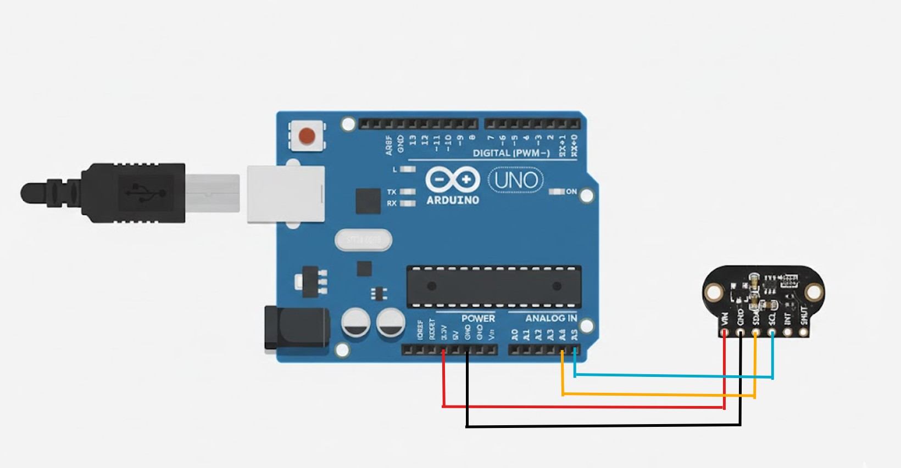
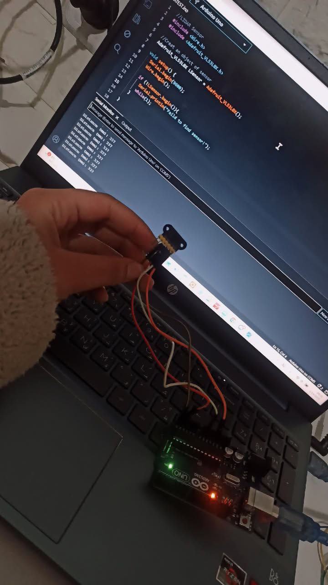

# VL53L0X Arduino LiDAR Distance Sensor 🚀

This project uses the **VL53L0X Time-of-Flight (ToF) LiDAR sensor** with Arduino to measure distance up to ~2 meters. Unlike traditional IR sensors, it **measures distance by timing laser pulses**, making it **less affected by ambient light**.

## Features
- Measures distance in millimeters.
- Works in low and bright light.
- Can detect objects from 30mm to 2000mm.
- Easy I2C communication.

## Wiring Diagram

| Sensor Pin | Arduino Pin |
|------------|-------------|
| VIN        | 3.3V          |
| GND        | GND         |
| SDA        | A4          |
| SCL        | A5          |
| INT        | Optional    |
| SHUT       | Optional    |

## How it works
- VL53L0X sends a **laser pulse**.
- Measures **time-of-flight** → time for the pulse to return.
- Calculates **distance = (time × speed of light)/2**.
- Prints distance on Serial Monitor.

## Tips & Notes
- Works best on reflective surfaces.
- Maximum range ~2 meters.
- For multiple sensors, use the SHUT pin to assign I2C addresses.

## References
- [Adafruit VL53L0X Guide](https://learn.adafruit.com/adafruit-vl53l0x-micro-lidar-distance-sensor-breakout/arduino-code)
- [VL53L0X Datasheet](https://www.st.com/resource/en/datasheet/vl53l0x.pdf)
- [Arduino I2C Communication](https://www.arduino.cc/en/reference/wire)

## Author

**Hala Gholeh**  
📧 Contact: hala.gholeh2002@gmail.com
🐦 LinkedIn: www.linkedin.com/in/hala-gholeh-96a003256

